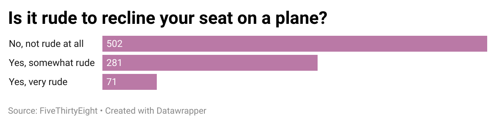

# Data-Journalism-week-4
## Why I chose this data
I chose this data because I have had numerous conversations regarding airplane etiquette with my friends and family and this point is always a very contested one. I found it interesting that the vast majority of people said it was not rude, which is not what I have found in the conversations with those close to me. In my opinion, I find it very iritating to have someone lean into my space on a long flight. 
### What my data says
My chart reveals that out of the 854 responses, 502 said it was ==not== rude to recline your seat. This means that nearly 60% on people do not view it as a breach of flying etiquette. 

